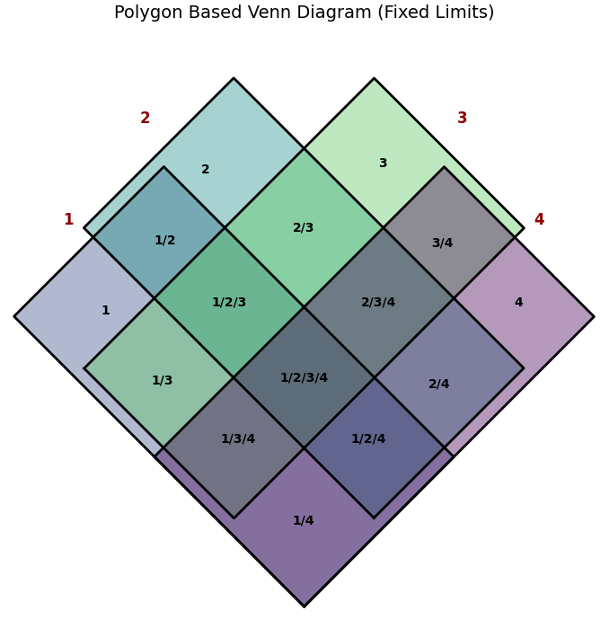

# overlapviz （Under development!）
A Python toolkit for professional set visualization, transforming complex data overlaps into intuitive Venn and UpSet plots.



## Features

- Draw Venn diagrams for 2-7 sets
- Draw UpSet plots for 7+ sets
- Pure matplotlib implementation
- Automatic selection of appropriate visualization type
- Customizable appearance

## Installation

```bash
pip install .
```

## Package Structure
